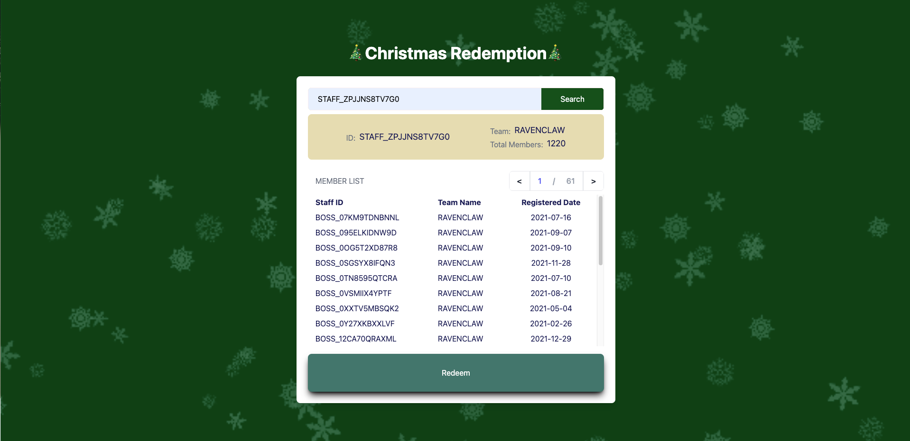

# Christmas Redemption System

🎄 Welcome to the Christmas Redemption System! Spread the holiday joy by efficiently managing the distribution of gifts to the teams in your department. This Node.js and Typescript-based system ensures a smooth process for representatives to redeem their team's gifts.

## Table of Contents

-   [Background](#background)
-   [Task](#task)
-   [Getting Started](#getting-started)
-   [Screenshots](#screenshots)

## Background

'Tis the season of giving, and you have the important task of distributing gifts to department teams. Each team can send a representative to redeem their gifts at the counter. The representative must show their staff pass as proof of identity, and each staff pass has a unique ID. A CSV file contains the mapping of staff pass IDs to their corresponding team names, along with the timestamp of when the mapping record was added.

## Task

Build a system that supports three main functions:

1. **Look up:** Perform a lookup of the representative's staff pass ID against the mapping file.
2. **Verify:** Verify if the team can redeem their gift by comparing the team name against past redemptions in the redemption data.
3. **Add Redemption:** Add new redemption to the redemption data if the team is still eligible; otherwise, send the representative away.

The redemption data should include at least the following information: `team_name` and `redeemed_at`, where the latter refers to the timestamp the redemption occurred in epoch milliseconds.

## Getting Started

Follow these steps to set up and run the Christmas Redemption System:

1. **Clone the Repository:**

```bash
git clone https://github.com/ScorpiusSigma/GovSupply-GovWallet-THA.git
cd christmas-redemption-system
```

2. **Install Dependencies:**

```bash
npm install
```

3. **Run the Application:**

```bash
npm run dev
```

## Screenshots

### Home Screen


### Search Screen



### Redeeming Screen


### Redeemed Screen


Feel the festive spirit as you manage the Christmas Redemption System with ease. Happy holidays! 🎅🎁

[A Take-Home Assignment by GovTech GovSupply GovWallet](./docs/Take-Home%20Assignment%2059666bf04ff7483ba95edeb4a75f0b1c.pdf)
